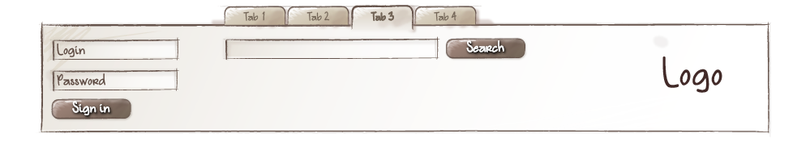
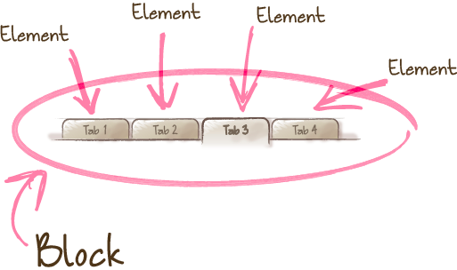

> [原文](https://en.bem.info/methodology/key-concepts/)
# BEM CSS命名规范二 Key concepts
### 关键概念
- 模块
- 元素
- 修饰
- BEM 实体
- 混合模式
- BEM 树
- 模块实现
- 实现方法
- 模块重定义
- 重定义级别
### 模块

一个在逻辑和功能上独立的页面组件，与 Web 组件中的组件概念是等同的。一个模块封装了行为（JavaScript），模板，样式（CSS），和其他技术实现。模块是独立的，允许我们重用，从而更好地促进项目的开发。

### 模块的特征
#### 嵌套结构
模块可以被其他的模块嵌套在内部。

比如：一个 `head` 模块可以包含一个 logo（`logo`），一个搜索框（`search`），和一个授权（登录/注册）模块（`auth`）。
  


#### 任意位置
模块可以在一个页面上使用，在多个页面间使用，或者在多个项目间使用。模块被实现为独立的实体，从而使得在页面中改变模块的位置成为可能，同时确保他们的功能和外观是正常的。

因此，logo 和 认证表单模块可以在不更改 CSS 和 JavaScript 代码的情况下互相交换位置。




#### 重用
一个界面可以包含多个相同模块的实例。


### 元素

元素是一个模块的组成部分，并且不可以在模块之外使用。

例如，一个菜单项不可以被单独使用在菜单模块的上下文之外，一次它是一个元素。



> [我应该在什么时候使用模块或元素](https://en.bem.info/methodology/faq/)

> [BEM 方法论中，创建元素的元素是不被推荐的](https://en.bem.info/methodology/faq/)

### 修饰符

一个可以定义模块或元素外观和行为的 BEM 实体。

是否使用修饰符，是可选择的。

本质上，修饰符和 HTML 属性是相似的。相同的模块看起来不同，正式由于使用了修饰符。

例如，菜单模块（`menu`）可能会改变它自己的外观，这取决于一个修饰符被使用在菜单模块上。


修饰符可以在程序运行时被改变（例如，模块的某个 DOM 事件被触发时），或者被其他模块所改变。

### BEM 实体

模块，元素和修饰符都被称为 BEM 实体。

这个概念可以被应用在一个单独的 BEM 实体上，也可以作为模块，元素和修饰符的统称。

### 混合模式

可以将多个不同的 BEM 实体整合为一个单独的 DOM 节点。

混合模式允许我们

- 结合多个 BEM 实体的行为和风格（样式），以及减少代码的重复
- 在已经存在的 BEM 实体的基础上创建新的新的界面组件。

让我们考虑一个将一个模块和另一个模块的元素混合的案例。

让我们假定通过一个 `link` 模块来实现你项目中的链接。我们需要将菜单项全部用链接实现。这有一些方式来实现我们的目的。

- 为菜单项创建一个可以将其转换为链接的修饰符。为了实现这样一个修饰符，必然会复制 link 模块的行为和样式。这将会造成代码的重复。
- 将一个通用的 `link` 模块和一个 `menu` 模块的 `link` 元素结合在一起。这两个 BEM 实体的混合模式允许我们使用 `link` 模块的链接功能，并且可以在不复制代码的情况下使用 `menu` 模块额外的 CSS 规则。

### BEM 树

一种使用模块，元素和修饰符的 web 页面结构的表示。是通过 BEM 实体名称对 DOM 树的抽象描述，包括他们的状态，顺序，嵌套和一些辅助性的数据。

在真实的项目中，一个 BEM 树可以被呈现在任何支持树结构的格式中。

让我们来看一个 DOM 树的例子：
```html
<header class="header">
    
    <form class="search-form">
        <input type="input">
        <button type="button"></button>
    </form>
    <ul class="lang-switcher">
        <li class="lang-switcher__item">
            <a class="lang-switcher__link" href="url">en</a>
        </li>
        <li class="lang-switcher__item">
            <a class="lang-switcher__link" href="url">ru</a>
        </li>
    </ul>
</header>
```
相应的 BEM 树看起来是这个样子的
```
header
    ├──logo
    └──search-form
        ├──input
        └──button
    └──lang-switcher
        └──lang-switcher__item
            └──lang-switcher__link
        └──lang-switcher__item
            └──lang-switcher__link
```
在 XML 和 BEMJSON格式中，相同的 BEM 树如下：

XML
```xml
<block:header>
    <block:logo/>
    <block:search-form>
        <block:input/>
        <block:button/>
    </block:search-form>
    <block:lang-switcher>
        <elem:item>
            <elem:link/>
        </elem:item>
        <elem:item>
            <elem:link/>
        </elem:item>
    </block:lang-switcher>
</block:header>
```
BEMJSON
```bemjson
{
    block: 'header',
    content : [
        { block : 'logo' },
        {
            block : 'search-form',
            content : [
                { block : 'input' },
                { block : 'button' }
            ]
        },
        {
            block : 'lang-switcher',
            content : [
                {
                    elem : 'item',
                    content : [
                        { elem : 'link' }  
                    ]
                },
                {
                    elem : 'item',
                    content : [
                        { elem : 'link' }
                    ]
                }
            ]
        }
    ]
}
```
### 模块实现

决定一个 BEM 实体包含如下一组不同的技术：

- 行为
- 外观
- 测试
- 模板
- 文档
- 依赖关系描述
辅助性数据（例如，图片）
### 实现技术

用于实现一个模块的相关技术。

模块可以使用一种或多种技术实现，比如：

- 行为 —— JavaScript,CoffeeScript
- 外观 —— CSS,Stylus,Sass
- 模板 —— BEMHTML,BH,Pug,Handlebars,XSL
- 文档 —— Markdown,Wiki,XML.

例如，如果一个模块的外观使用 CSS 定义，这表明这个模块使用 CSS 技术被实现。同样。如果使用 Markdown 书写一个模块的文档，那么该模块使用 Markdown 技术实现。

### 模块重定义

通过在不同的级别上添加新的功能来更改模块的实现。

### 重新定义级别

重定义级别指一组 BEM 实体和他们的部分实现。

模块的最终实现可以被分成不同的定义级别上。每一个新的级别继承或者覆盖之前的对模块的实现。最终的结果是由按照连续顺序的每个重定义的级别上的模块的实现技术组装而成的。

每一个级别上对 BEM 实体的实现技术都可以被重新定义。

例如，这里有一个项目，在该项目的一个单独的级别上使用了一个第三方库。该第三方库实现有现成的模块。该具体项目的模块被保存在另一个重定义级别上。

比方说，我们需要修饰第三库其中的某一个模块的外观。不需要在第三方库的源码中修改模块的 CSS 规则，或者将代码复制到项目级别中。我们只需要在项目级别上为模块创建一些额外的 CSS 规则。在项目构建过程中，最终实现将会结合库级别的原有规则和项目级别中新的样式规则。
